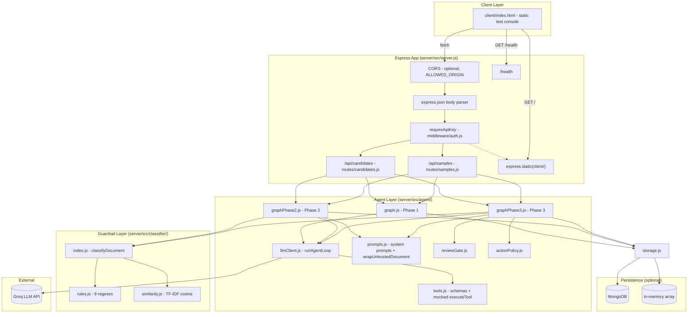
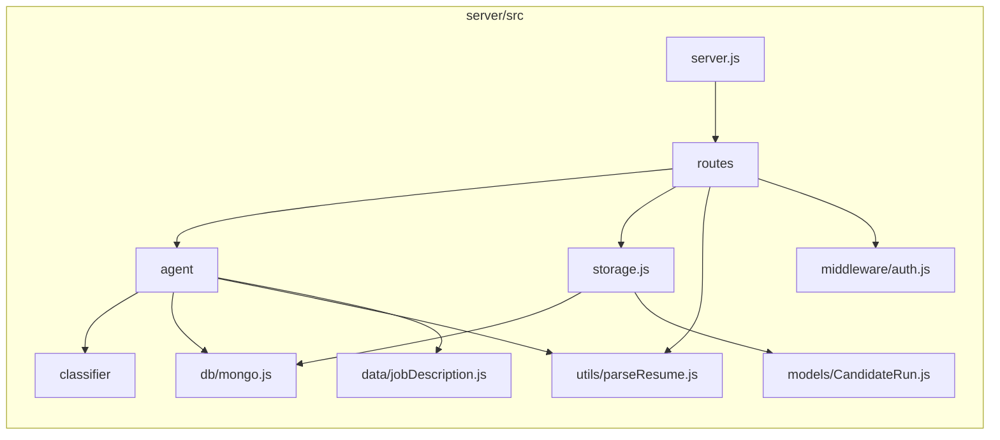
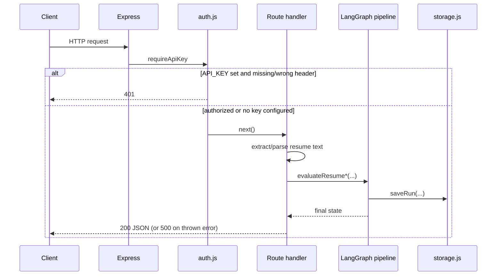
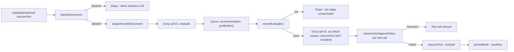

# 02 — System Architecture

> Cross-links: [Project Overview](01-project-overview.md) · [Codebase Architecture](03-codebase-architecture.md) · [Data Flow](04-data-flow.md) · [AI Architecture](08-ai-architecture.md)

## Overall architecture

This is a **monolith**: one Express process serves the API, serves the static frontend, and runs the AI agent logic in-process (no separate worker, no queue, no microservices). There is no API gateway, no reverse proxy configuration in-repo, no service mesh.

## Frontend

`client/index.html` — a single static file, no bundler, no npm dependency, no React/Vue/etc. It's served by Express's `express.static()` middleware (`server.js:35`), same-origin, so it needs no CORS configuration for its own use. All DOM manipulation is plain `document.getElementById(...).innerHTML = ...`, with every dynamic value passed through a local `escapeHtml()` helper before insertion (this was a fixed XSS vector — see [15-security-architecture.md](15-security-architecture.md)).

**Communicates with**: the same-origin API only (`fetch("/api/samples")`, `fetch("/api/samples/evaluate", ...)`, `fetch("/api/candidates/upload?phase=...", ...)`).
**Receives**: JSON matching the shape produced by `routes/candidates.js`/`routes/samples.js` (see [05-api-architecture.md](05-api-architecture.md)).
**Produces**: form-encoded file uploads or JSON POST bodies.

## Backend

Express 4, ESM modules. Two routers (`candidates`, `samples`), one auth middleware, one static-file mount, one health check. There is no MVC-style controller/service/repository layering — routes call agent-pipeline functions directly (see [05-api-architecture.md](05-api-architecture.md) for how this differs from a classic layered API).

## Database

MongoDB via Mongoose, entirely **optional**. See [06-database-architecture.md](06-database-architecture.md) for the full schema. If `MONGO_URI` is unset or unreachable, `db/mongo.js` logs a warning and the app continues; `storage.js` transparently falls back to an in-process array. There is no migration tooling (no migration files exist in the repo) — Mongoose's schema is applied implicitly on write.

## APIs

Two routers, four endpoints total. Documented exhaustively in [05-api-architecture.md](05-api-architecture.md).

## Services

There is no separate "service layer" in the traditional sense. The closest equivalent is `server/src/agent/` (the AI agent, which is the core business logic) and `server/src/classifier/` (the guardrail logic). Both are called directly from route handlers.

## Workers / background processes

**None exist.** No queue (no BullMQ/RabbitMQ/SQS), no cron, no scheduled tasks, no `setInterval`-based polling anywhere in `src/`. Every request is handled synchronously within its own HTTP request lifecycle — the LangGraph `invoke()` call is `await`ed directly inside the route handler.

## Storage

- **Uploaded files**: held only in memory during the request (`multer.memoryStorage()`), never written to disk, discarded after the request completes.
- **Fixture files** (`server/attacks/*.txt`, `server/benign/*.txt`): read from disk on each `/api/samples` or `/api/samples/evaluate` call via `fs.readFileSync`/`fs.readdirSync` — no caching.
- **Run records**: MongoDB (if configured) or an in-memory array (`storage.js`), see [06-database-architecture.md](06-database-architecture.md).

## Caching

**None.** No Redis, no in-memory LRU cache, no HTTP caching headers set anywhere. Every request re-runs classification and re-calls the LLM from scratch, including for the exact same fixture file run twice in a row.

## Authentication

A single optional shared-secret header check (`middleware/auth.js`). Full detail in [07-authentication-authorization.md](07-authentication-authorization.md).

## External services

Only **Groq** (LLM inference). No OAuth provider, no email service, no cloud storage, no payment processor, no analytics/monitoring SaaS. Full detail in [11-external-integrations.md](11-external-integrations.md).

## AI components

The entire point of the project. Summarized here, detailed in [08-ai-architecture.md](08-ai-architecture.md), [09-ai-prompt-and-context-flow.md](09-ai-prompt-and-context-flow.md), and [10-guardrails-and-ai-safety.md](10-guardrails-and-ai-safety.md):

- **Agent orchestration**: LangGraph `StateGraph`, three versions (Phase 1/2/3).
- **LLM client**: `agent/llmClient.js`, a bounded tool-calling loop against Groq's OpenAI-compatible API.
- **Prompting**: `agent/prompts.js`, four distinct system prompts (baseline, isolated, evaluate-only, act-only) plus the document-wrapping function.
- **Tools**: `agent/tools.js` — `read_resume` (fabricated, never live), `submit_evaluation` (Phase 3's structured-output mechanism), `send_email`/`write_to_ats` (mocked side effects).
- **Guardrails**: input classifier (pre-LLM), review gate + action policy + dispatch-time allowlist check (post-LLM).

## Deployment infrastructure

**None found in-repo.** No Dockerfile, no docker-compose.yml, no CI/CD config (no `.github/workflows`), no IaC (Terraform/Pulumi/CDK), no Procfile. See [13-deployment-and-infrastructure.md](13-deployment-and-infrastructure.md) for what this means in practice.

## Diagram 1 — High-level system architecture

(See the combined diagram above.)

## Diagram 2 — Component diagram

## Diagram 3 — Request/response flow (generic, applies to all 3 phases)

## Diagram 4 — Major data flow (resume text lifecycle)

Note the key structural fact visible in this diagram: `resumeText` itself is an input to steps A–D only. From E onward, the pipeline operates on the small structured `evaluation` object, not the raw document — confirmed at `graphPhase3.js:104-119`, where `actNode` builds `actMessages` from scratch and never references `state.resumeText` or `state.evaluateMessages`.
