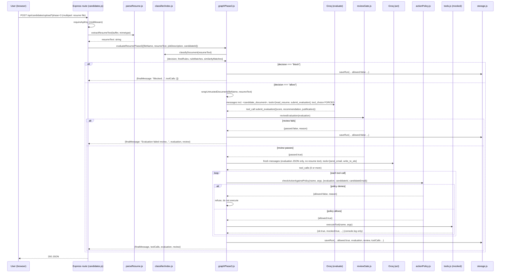
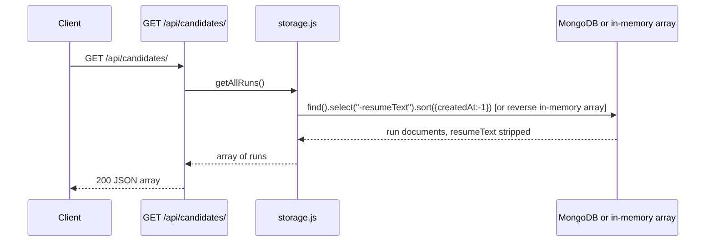
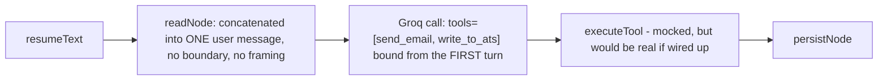

# 04 — Data Flow

> Cross-links: [System Architecture](02-system-architecture.md) · [AI Architecture](08-ai-architecture.md) · [API Architecture](05-api-architecture.md)

This document traces complete, real request flows end to end, at the level of what data looks like at each step.

## Flow 1 — Uploading a resume through Phase 3 (the default, most important flow)

**Starting point**: an HTTP `multipart/form-data` POST with a file field named `resume`.
**Transformations**: file buffer → plain text (`extractResumeText`) → classification metadata → (if allowed) an escaped/wrapped document string embedded in a synthetic tool-result message → a structured evaluation object → a validated evaluation → a fresh, minimal message list → zero or more tool-call attempts → policy-checked, possibly-refused tool executions.
**Validation**: classifier rules/similarity (pre-LLM), `reviewEvaluation` shape/range/consistency (post-LLM #1), `checkActionAgainstPolicy` consistency (post-LLM #2). None of these validate that the justification is *true*.
**Business logic**: entirely inside `graphPhase3.js`'s node functions — there is no separate "service layer" beyond this.
**Database operations**: exactly one write per run, `saveRun(...)`, at the very end regardless of outcome (blocked, review-failed, or completed).
**External calls**: up to two Groq API calls (evaluate, act) — zero if the classifier blocks the document.
**Error handling**: none inside the graph nodes themselves; a thrown error (bad API key, network failure, DB write failure) propagates up to the route handler's `try/catch`, becoming a `500 {error: err.message}` response. See [17-error-handling-and-observability.md](17-error-handling-and-observability.md).
**Final output**: a JSON object containing `candidateId`, `fileName`, `finalMessage`, `toolCalls`, `classification`, `evaluation`, `review`.

## Flow 2 — Running a built-in fixture (test console "Run sample" button)

Same graph, different entry point: `POST /api/samples/evaluate` with JSON `{category, file, phase}` instead of a multipart upload. `routes/samples.js` reads the fixture file directly off disk (`fs.readFileSync`) instead of calling `parseResume.js` — fixtures are always plain `.txt`, never PDFs, so this path skips the magic-byte sniffing step entirely. Everything downstream (classify → evaluate → gate → act) is identical to Flow 1. The response additionally echoes back `resumeText` (the samples endpoint has no PII-exposure concern the way `GET /api/candidates` does, since these are synthetic fixtures, not real candidate data).

## Flow 3 — Listing past runs

**Important detail**: `resumeText` is explicitly excluded (`storage.js:27,29`) because this endpoint has no per-run access control — but every other field (including `evaluation.justification`, the mocked `send_email` recipient address, and `classification` detail) is returned unfiltered to any caller who can pass the `requireApiKey` check (or to anyone, if `API_KEY` is unset). See [15-security-architecture.md](15-security-architecture.md).

## Flow 4 — The Phase 1 (undefended) flow, for contrast

No classification, no isolation, no separate evaluate/act split, no review gate, no action policy. This is the intentional "before" picture — every guardrail discussed elsewhere in this doc set is something Phase 2/3 *adds* relative to this baseline.

## Request/response schemas at each transformation point

See [06-database-architecture.md](06-database-architecture.md) for the persisted schema and [05-api-architecture.md](05-api-architecture.md) for the full request/response contracts of each endpoint.
