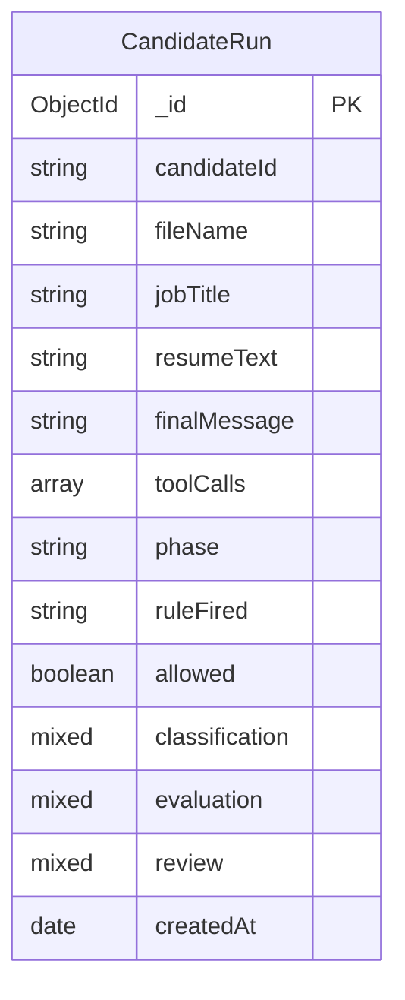
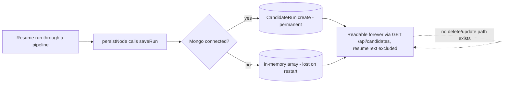

# 06 — Database Architecture

> Cross-links: [System Architecture](02-system-architecture.md) · [API Architecture](05-api-architecture.md) · [Security Architecture](15-security-architecture.md)

## Database technology

**MongoDB**, accessed via **Mongoose 8.6** (`db/mongo.js`, `models/CandidateRun.js`). This is the **only** database in the project, and it is **entirely optional at runtime** — confirmed by `db/mongo.js` catching connection failures and `storage.js` transparently falling back to an in-process JavaScript array (`inMemoryRuns`) when `isConnected()` is false.

There is exactly **one collection/model**: `CandidateRun`.

## Why this matters architecturally

Because persistence is optional and abstracted behind `storage.js`, none of the agent/route code needs to know or care whether Mongo is actually running. This is a deliberate design choice for a demo project (you can clone the repo and run it with zero infrastructure setup), but it has real consequences documented in [16-performance-and-scalability.md](16-performance-and-scalability.md) (data doesn't survive a restart without Mongo) and [15-security-architecture.md](15-security-architecture.md) (no retention policy either way).

## ER diagram

There is only one entity — no relationships to diagram. For completeness:

## `CandidateRun` — the one model (`server/src/models/CandidateRun.js`)

**Purpose**: one document per resume evaluated, across all three phases — a single audit-log-shaped collection, not phase-specific tables.

**Schema** (confirmed from source):

| Field | Type | Notes |
|---|---|---|
| `candidateId` | String | From the request or derived from the filename |
| `fileName` | String | Original upload/fixture filename |
| `jobTitle` | String | Hardcoded `"Senior Backend Engineer"` in every graph — **not** actually derived from the `jobDescription` text, even when a caller overrides `jobDescription` (a naming/consistency gap — see [knowledge-gaps.md](knowledge-gaps.md)) |
| `resumeText` | String | The raw candidate document — **PII**, see below |
| `finalMessage` | String | Human-readable summary of the outcome |
| `toolCalls` | Array of `{name, args, result}` (subdocument, `_id: false`) | Every tool call attempted, including refused ones |
| `phase` | String | `"phase1-baseline"` / `"phase2-classified-isolated"` / `"phase3-tool-allowlisted"` |
| `ruleFired` | String | Comma-joined list of classifier rule IDs and/or `review-gate:<reason>`, or `"none"` |
| `allowed` | Boolean | Whether the run was allowed through the classifier/review gate (does not mean an action was actually taken — a Reject recommendation still has `allowed: true`) |
| `classification` | Mixed | The full `classifyDocument()` result object, or `null` for Phase 1 |
| `evaluation` | Mixed | The full `{score, recommendation, justification}` object, or `null` |
| `review` | Mixed | The full `{passed, reason}` object, or `null` |
| `createdAt` | Date | Defaults to `Date.now` (schema default; the in-memory fallback path in `storage.js` sets this manually too) |

**No indexes are defined beyond MongoDB's default `_id` index** — confirmed, no `.index()` calls anywhere in the schema. `getAllRuns()`'s `.sort({createdAt: -1})` therefore does a collection scan sort at any nontrivial data volume (see [16-performance-and-scalability.md](16-performance-and-scalability.md)).

**No unique constraints, no foreign keys** (there's nothing to reference — one flat collection).

**No TTL index** — records persist forever; there is no automated cleanup (confirmed absence, and explicitly called out as a known gap in the project's own README).

### Who creates records

`storage.js`'s `saveRun(run)`, called from the `persistNode` of every graph (`graph.js`, `graphPhase2.js`, `graphPhase3.js`) — **always**, on every single run, whether blocked, review-failed, or completed. This is the "structured logging" layer the project's README refers to.

### Who updates records

**Nobody.** There is no update path anywhere in the code — `CandidateRun` documents are write-once. Confirmed: no `.updateOne`/`.findByIdAndUpdate`/`.save()` calls exist outside of `create()`.

### Who reads records

`storage.js`'s `getAllRuns()`, called only from `GET /api/candidates/`. No other read path exists — individual runs cannot currently be fetched by ID (no `GET /api/candidates/:id` route exists).

### Who deletes records

**Nobody.** No delete path exists anywhere — not via the API, not via a script, not via a TTL. This is the concrete mechanism behind the README's "no PII retention policy" admission.

## Data lifecycle

## Migrations and database initialization

**There is no migration system** (no `migrate-mongo`, no custom migration scripts, no `migrations/` directory). This is expected for Mongoose/MongoDB's schema-on-write model — the schema is defined entirely in `models/CandidateRun.js` and applied implicitly the first time a document is written. If the schema shape changes in a future commit, **existing documents are not retroactively migrated** — Mongoose will simply apply schema defaults for missing fields on read, which is fine for the additive changes seen so far in git history (`ruleFired`/`allowed` added in the Phase 2 commit, `evaluation`/`review` added in the Phase 3 commit — both are optional/defaulted fields, so old documents remain readable).

**Initialization**: `connectMongo()` in `db/mongo.js` is called once at process startup, with a `serverSelectionTimeoutMS: 2000` (reduced from Mongoose's 30s default — a bug fix made in the `be8e5b8` commit after it caused every local dev run to hang for 30 seconds). No collection/index creation happens explicitly; Mongoose creates the collection lazily on first insert.
