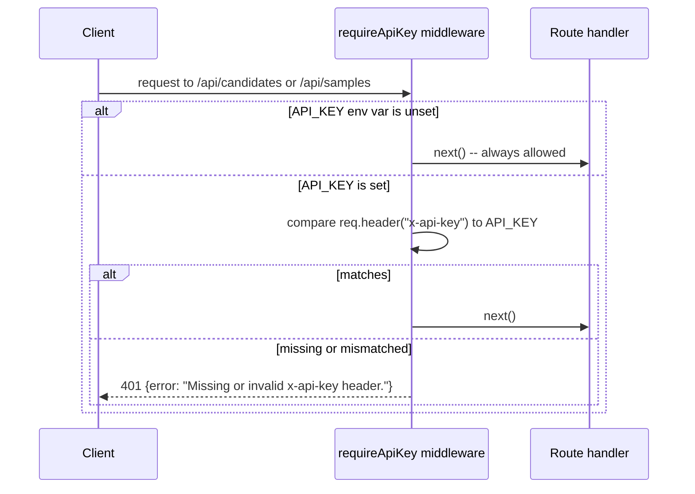

# 07 — Authentication & Authorization

> Cross-links: [API Architecture](05-api-architecture.md) · [Security Architecture](15-security-architecture.md) · [Configuration](12-configuration-and-environment.md)

## Summary

There is **no authentication system** in the traditional sense — no registration, no login, no sessions, no JWTs, no OAuth, no password storage, no refresh tokens, no roles, no permissions. All of these sections of a typical "auth" document are **not applicable** to this codebase. What exists instead is a single, optional shared-secret check.

## What actually exists: `middleware/auth.js`

```js
export function requireApiKey(req, res, next) {
  const configuredKey = process.env.API_KEY;
  if (!configuredKey) return next();               // no key configured = open access
  const providedKey = req.get("x-api-key");
  if (providedKey !== configuredKey) {
    return res.status(401).json({ error: "Missing or invalid x-api-key header." });
  }
  return next();
}
```

- **Mechanism**: a single static secret, set via the `API_KEY` environment variable, compared against the `x-api-key` request header.
- **Identity**: none. There is no concept of "who" is calling — the key is a shared bit, not a per-user credential. Every caller with the correct key has identical, full access to every endpoint it gates.
- **Scope**: gates `/api/candidates/*` and `/api/samples/*` (`server.js:33-34`). Does **not** gate `/health` or the static `client/` files — those are always public.
- **Default state**: `API_KEY` is empty in `.env.example`, meaning **the default, out-of-the-box configuration is fully open access** with a console warning logged once at startup (`server.js:27-31`).
- **Comparison method**: a plain `!==` string comparison, not a constant-time comparison — see [15-security-architecture.md](15-security-architecture.md) for the timing-side-channel note (low real-world risk here given the deployment context, but worth knowing).

## Sequence diagram



## What this means in practice

- **Registration / Login / Logout**: not applicable — there is no user model at all (confirmed: no `User` schema exists anywhere in `models/`).
- **Sessions / JWT / OAuth**: not applicable — no session store, no token library (`jsonwebtoken`, `passport`, etc.) appears in `package.json`.
- **Password handling**: not applicable — nothing stores or checks a password.
- **Roles / Permissions**: not applicable — everyone with the key has the same access; there's no admin/user distinction, and no per-candidate ownership concept (see [15-security-architecture.md](15-security-architecture.md) for why `GET /api/candidates/` returning all runs to any key-holder is a real gap).
- **Protected routes**: `/api/candidates/*`, `/api/samples/*`. **Unprotected**: `/health`, `client/index.html` and any other static asset Express serves from `client/`.
- **Credential storage**: the only "credential" is `API_KEY` itself, stored in `.env` (gitignored) and read via `process.env`. It is never hashed or otherwise transformed — it's a raw shared secret compared directly.

## The project's own stated intent

The code comment in `auth.js` is explicit that this is a stopgap, not a real system: *"Minimal shared-secret auth, not a real auth system... exists only to close the 'anyone who can reach this API can run the LLM and read stored resumes' gap for a demo/portfolio deployment. A production system needs real authentication (OAuth/SSO) and authorization (who can see which candidate's data), not this."* This matches what the code actually does — there is no overclaiming here to correct.
