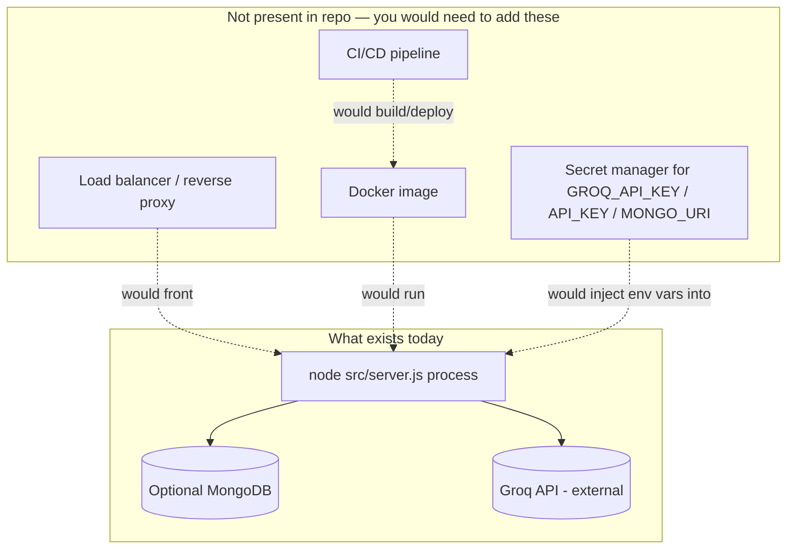

# 13 — Deployment & Infrastructure

> Cross-links: [Configuration](12-configuration-and-environment.md) · [Performance & Scalability](16-performance-and-scalability.md)

## What exists

**Nothing.** This is confirmed by a full repository scan: there is no `Dockerfile`, no `docker-compose.yml`, no `.github/workflows/` (or any other CI config — GitLab CI, CircleCI, etc.), no Terraform/Pulumi/CDK/Ansible, no `Procfile`, no `vercel.json`/`netlify.toml`/platform-specific deploy config, no health-check-driven orchestration config beyond the one `/health` route in `server.js` itself.

This means: **this project currently only runs as `node src/server.js` on a machine with Node.js installed and the right environment variables set.** Anything beyond that (containerization, CI, cloud deployment) would need to be built from scratch.

## What "running it" looks like today

```bash
cd server
cp .env.example .env      # then edit .env
npm install
npm run dev                # node src/server.js, listens on :4000 by default
```

There is no build step (no TypeScript compilation, no bundler, no asset pipeline) — `server.js` runs directly via Node's native ESM support, and `client/index.html` is served as-is with no processing.

## Health checks

One route exists: `GET /health` → `{ok: true}` (`server.js:37`). It performs no actual dependency checks (does not verify Mongo connectivity or Groq reachability) — it will return `200 {ok:true}` even if MongoDB is unreachable (since Mongo is optional and the app degrades gracefully) or even if `GROQ_API_KEY` is invalid (since that failure only surfaces when an actual LLM call is attempted). **This is a liveness check, not a readiness check** — it tells you the process is up, not that its dependencies are healthy.

## Networking

Single Express process, single port (`PORT`, default `4000`). No reverse proxy, no TLS termination configured in-code (would need to be handled by whatever sits in front of this in a real deployment — nginx, a cloud load balancer, etc., none of which is configured here). CORS is off by default and only enabled for a single configured origin via `ALLOWED_ORIGIN` (see [07](07-authentication-authorization.md)/[15](15-security-architecture.md)).

## Build process

None — see above. `package.json` has no `build` script.

## Scaling

**Horizontal scaling is not supported out of the box.** If `MONGO_URI` is unset, run state (`inMemoryRuns` in `storage.js`) lives in a single process's memory — running multiple instances behind a load balancer would give each instance a different, incomplete view of `GET /api/candidates/` history, and there's no shared session/cache layer to reconcile this. With Mongo configured, the app *would* be closer to horizontally scalable (state lives in the shared DB), but this has not been tested or explicitly designed for (no connection-pool tuning, no graceful-shutdown handling for in-flight LLM calls during a rolling deploy). See [16-performance-and-scalability.md](16-performance-and-scalability.md).

**Vertical scaling**: the app is a single Node.js event loop; CPU-bound work is minimal (regex/TF-IDF classification is cheap), so the practical bottleneck under load would be concurrent Groq API calls and their latency, not local CPU/memory.

## Deployment architecture (what you'd need to build)



## What a minimal real deployment would need to add (inferred, not present)

1. A `Dockerfile` (Node base image, `npm ci`, `CMD ["node", "src/server.js"]`).
2. A process manager or orchestrator (systemd, PM2, or a container platform) for restart-on-crash — currently, an uncaught exception outside Express's request handling (there isn't one observed, but it's not defensively ruled out either) would kill the whole process with nothing to restart it.
3. A secrets manager or platform-native env var injection for `GROQ_API_KEY`/`API_KEY`/`MONGO_URI`.
4. TLS termination in front of the app (Express itself serves plain HTTP here).
5. A managed MongoDB instance (Atlas or similar) if persistence across restarts/instances is desired.
6. Log aggregation, since all output currently goes to stdout/stderr via `console.*` with no structured format (see [17-error-handling-and-observability.md](17-error-handling-and-observability.md)).

This entire section is **inferred/prescriptive**, not a description of anything in the repository — it's included because the task explicitly asked for a deployment architecture, and the honest answer is "there isn't one yet."
