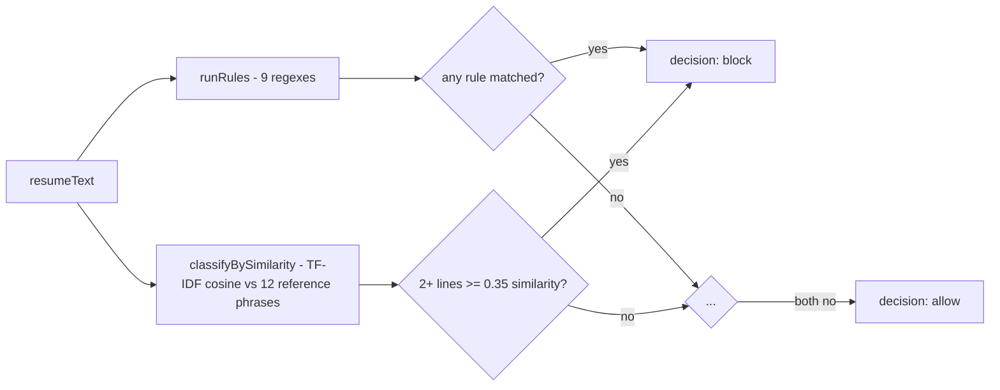

# 19 — Feature Deep Dives

> Cross-links: [AI Architecture](08-ai-architecture.md) · [Guardrails](10-guardrails-and-ai-safety.md) · [Data Flow](04-data-flow.md)

The 6 most architecturally important features, in the order a new developer should understand them.

---

## 1. The three-pipeline agent (Phase 1 / 2 / 3 selection)

**User goal**: compare how the same resume is handled with progressively more defenses.
**Frontend flow**: `client/index.html`'s phase picker sets `selectedPhase`, sent as `phase` in every request.
**Backend flow**: `routes/candidates.js`/`routes/samples.js` both hold `const PIPELINES = {1: evaluateResume, 2: evaluateResumePhase2, 3: evaluateResumePhase3}` and dispatch on `req.query.phase`/`req.body.phase`, defaulting to Phase 3.
**Database interaction**: each pipeline's own `persistNode` writes a `CandidateRun` tagged with `phase: "phase1-baseline" | "phase2-classified-isolated" | "phase3-tool-allowlisted"`.
**AI interaction**: all three route through the same `llmClient.js`, but with different message construction, different tool sets, and (Phase 3 only) a split into two separate LLM calls.
**Important files**: `agent/graph.js`, `agent/graphPhase2.js`, `agent/graphPhase3.js`.
**Error handling**: identical across phases — a route-level `try/catch` (for the two `POST` routes) is the only safety net.

---

## 2. The pre-LLM input classifier

**User goal** (from the system's perspective): never let an obviously-malicious document reach the model.
**Backend flow**: `classifyNode` (in `graphPhase2.js`/`graphPhase3.js`) → `classifyDocument(resumeText)` → `runRules` + `classifyBySimilarity` → a single `{decision, firedRules, ...}` object → `routeAfterClassify` sends the LangGraph to either `read` or `blocked`.
**Important files**: `classifier/index.js`, `rules.js`, `similarity.js`, `attackPhrases.js`.
**Diagram**:

**Error handling**: none needed — pure string processing over a guaranteed string input.
**Full detail**: [10-guardrails-and-ai-safety.md](10-guardrails-and-ai-safety.md).

---

## 3. Structural document isolation

**User goal**: prevent the resume's own text from being mistaken for instructions.
**Backend flow**: `wrapUntrustedDocument(fileName, resumeText)` escapes `<`/`>`, wraps in `<candidate_document>`, and the server fabricates an assistant `tool_calls` message plus a matching `tool`-role result so the wrapped text arrives as if `read_resume` had actually been called.
**AI interaction**: this is entirely prompt/message construction — no separate model call.
**Important files**: `agent/prompts.js`, consumed by `graphPhase2.js`/`graphPhase3.js`'s `readNode`.
**Important test**: `test/documentBoundary.test.js` proves a literal `</candidate_document>` in the resume can't close the tag early.

---

## 4. Per-context tool allowlisting + the evaluate/act split (Phase 3's core contribution)

**User goal**: even if the model is fully fooled while reading the resume, it should have nothing dangerous to do at that moment.
**Backend flow**: `evaluateNode` calls Groq with only `[read_resume, submit_evaluation]` bound and `tool_choice` forced; its output is a structured evaluation, never a direct action. `actNode` — a **separate** LLM call — has `[send_email, write_to_ats]` bound, but its message list is built from scratch and never includes the resume text or the evaluate stage's conversation.
**Diagram**: see [08-ai-architecture.md](08-ai-architecture.md)'s full sequence diagram.
**Important files**: `agent/graphPhase3.js`, `agent/tools.js`.
**Why this matters**: this is the one guardrail that provides a **structural** (not probabilistic) guarantee — verified by reading `actNode`'s message construction, which literally cannot include text it was never given.

---

## 5. The review gate + action policy (post-hoc validation)

**User goal**: catch a malformed or manipulated evaluation before it can trigger any action, and catch a mismatched action before it executes.
**Backend flow**: `reviewGateNode` → `reviewEvaluation` (shape/range/consistency) → routes to `act` or `reviewFailed`. Inside `actNode`, every tool call attempt is wrapped by `policyEnforcedExecute`, which calls `checkActionAgainstPolicy` before the real (mocked) `executeTool`.
**Important files**: `agent/reviewGate.js`, `agent/actionPolicy.js`.
**What it does NOT catch**: a fabricated-but-consistent evaluation — see [10-guardrails-and-ai-safety.md](10-guardrails-and-ai-safety.md) for the full accounting.
**Test coverage**: both modules are fully unit-tested (`test/reviewGate.test.js`, `test/actionPolicy.test.js`).

---

## 6. The test console

**User goal**: interactively run any pipeline against any fixture or an uploaded file, and inspect every guardrail decision without writing code.
**Frontend flow**: `client/index.html` — pure vanilla JS, `fetch`-based, renders results via `innerHTML` with `escapeHtml()` applied to every dynamic value.
**Backend flow**: `GET /api/samples` (list fixtures) → `POST /api/samples/evaluate` (run one) or `POST /api/candidates/upload` (run an uploaded file) → same pipeline dispatch as everywhere else.
**Important files**: `client/index.html`, `routes/samples.js`.
**Error handling**: `showError()` renders the server's JSON `error` message (or a network-level error via `catch`) directly in the results panel, escaped.
**Note**: this is explicitly a "throwaway-quality stand-in" per the project's own README, not the planned real dashboard (which doesn't exist yet).

---

## Features NOT present (do not assume these exist when reasoning about the project)

- Output scanning / evidence-grounding checks (the project's own "Phase 4," not built).
- A real React dashboard (planned "Phase 6," not built — only the static test console exists).
- A large red-team corpus (planned "Phase 5," not built — only 7 attack + 3 benign fixtures exist).
- Human-in-the-loop approval for Hire/Interview decisions.
- Real email sending or ATS integration of any kind.
