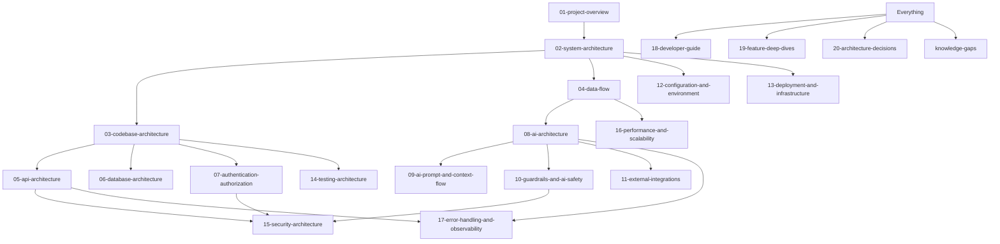

# Doorman — Architecture Documentation (Master Map)

This is the entry point for understanding the Doorman codebase deeply — not as a generic AI-guardrails tutorial, but as an explanation of exactly what *this* repository's code does, file by file. Every document here treats the source code as the source of truth and cross-checks claims made in the project's own `README.md` rather than assuming they're accurate (they mostly are — but I verified, not assumed).

## Recommended reading order

### Beginner (get oriented — ~20 minutes)
1. [01-project-overview.md](01-project-overview.md) — what this project is, in plain language first
2. [02-system-architecture.md](02-system-architecture.md) — the big picture, with diagrams
3. [08-ai-architecture.md](08-ai-architecture.md) — the AI system, explained simply before it gets technical

### Intermediate (understand how it actually works — ~45 minutes)
1. [03-codebase-architecture.md](03-codebase-architecture.md) — the repo, directory by directory
2. [04-data-flow.md](04-data-flow.md) — real requests traced end to end
3. [09-ai-prompt-and-context-flow.md](09-ai-prompt-and-context-flow.md) — exactly what the model sees, with a worked example
4. [10-guardrails-and-ai-safety.md](10-guardrails-and-ai-safety.md) — every guardrail, WHAT/WHY/WHERE/HOW
5. [05-api-architecture.md](05-api-architecture.md) — every endpoint, in detail
6. [06-database-architecture.md](06-database-architecture.md) — the one model, its full lifecycle

### Advanced (evaluate and extend it — ~40 minutes)
1. [15-security-architecture.md](15-security-architecture.md) — implemented protections vs. real gaps
2. [20-architecture-decisions.md](20-architecture-decisions.md) — why it's built this way, confirmed vs. inferred
3. [knowledge-gaps.md](knowledge-gaps.md) — what nobody (including this review) can currently answer
4. [18-developer-guide.md](18-developer-guide.md) — how to actually change things
5. [19-feature-deep-dives.md](19-feature-deep-dives.md) — the 6 most important features, individually

### Reference (read as needed, not in order)
- [07-authentication-authorization.md](07-authentication-authorization.md)
- [11-external-integrations.md](11-external-integrations.md)
- [12-configuration-and-environment.md](12-configuration-and-environment.md)
- [13-deployment-and-infrastructure.md](13-deployment-and-infrastructure.md)
- [14-testing-architecture.md](14-testing-architecture.md)
- [16-performance-and-scalability.md](16-performance-and-scalability.md)
- [17-error-handling-and-observability.md](17-error-handling-and-observability.md)

## Dependency map — which document explains which part of the system

| If you want to understand... | Read |
|---|---|
| What this project is for, at all | [01](01-project-overview.md) |
| How the pieces fit together | [02](02-system-architecture.md), [03](03-codebase-architecture.md) |
| What happens on a real request | [04](04-data-flow.md), [05](05-api-architecture.md) |
| Where data is stored | [06](06-database-architecture.md) |
| Who can access what | [07](07-authentication-authorization.md) |
| The AI system itself | [08](08-ai-architecture.md), [09](09-ai-prompt-and-context-flow.md) |
| The prompt-injection defenses specifically | [10](10-guardrails-and-ai-safety.md) |
| What talks to what outside this codebase | [11](11-external-integrations.md) |
| Environment variables and setup | [12](12-configuration-and-environment.md) |
| How/whether this runs in production | [13](13-deployment-and-infrastructure.md) |
| What's actually tested | [14](14-testing-architecture.md) |
| Real vs. theoretical security risk | [15](15-security-architecture.md) |
| Speed/scale limits | [16](16-performance-and-scalability.md) |
| Debugging a failure | [17](17-error-handling-and-observability.md) |
| Making a change yourself | [18](18-developer-guide.md) |
| The most important features individually | [19](19-feature-deep-dives.md) |
| Why it was built this way | [20](20-architecture-decisions.md) |
| What's still unknown or shaky | [knowledge-gaps](knowledge-gaps.md) |

---

## PROJECT MENTAL MODEL

*If you open this repository tomorrow, this is what you should hold in your head.*

**What it is.** Doorman is one AI agent — a resume screener — implemented three times with increasing amounts of self-defense. It is not a product with users; it's a security-engineering demonstration with real code and real (small-scale) data behind its claims. The whole project exists to answer one question concretely: *if an attacker can write anything they want into a document your AI agent reads, what's the actual, verifiable limit on what that agent can be tricked into doing?* The answer this codebase gives, embodied in working code rather than just an essay, is: **you can't reliably stop the model from being fooled about the content, but you can structurally prevent a fooled model from having dangerous capabilities at the moment it's most exposed to attacker text.**

**The one mental model that unlocks everything else**: there are three pipelines, not three apps. `graph.js` (Phase 1) is a straight line — read the resume, decide, act, all bound together with full tool access from the first token. `graphPhase2.js` (Phase 2) adds a gate in front (the classifier) and changes how the resume is *presented* to the model (a tagged, escaped, tool-result-framed block instead of raw pasted text) — but it's still one LLM call with full tool access. `graphPhase3.js` (Phase 3, the default) is the one that actually changes the *shape* of the interaction: it splits "read and judge" from "act" into two separate LLM calls, and the second call is deliberately built from a blank slate that never contains the original resume. Everything else in the codebase — the review gate, the action policy, the dispatch-time allowlist check — exists to backstop that split with code-level checks instead of trusting the system prompt's instructions.

**The one gap that unlocks everything about its limitations**: none of the code — not the classifier, not the review gate, not the action policy — ever compares the model's stated justification against the actual resume text to check if it's *true*. Every guardrail here checks *shape*, *consistency*, or *capability*, never *truthfulness*. A resume that fully convinces the evaluate-stage model of a false narrative will sail through the entire Phase 3 pipeline as a "legitimate," internally consistent decision, and every downstream guardrail will faithfully carry out exactly that (wrong) decision. This isn't a bug the code is hiding — it's the explicitly acknowledged edge of what this project has built so far, and it's the reason none of the language in this documentation set calls the system "safe" — only "contained."

**The one operational fact that keeps you from overestimating what's real**: `send_email` and `write_to_ats` never contact anything. They `console.log` and return `{ok:true}`. Every "attack succeeded" or "attack was blocked" verdict in this project's own README refers to whether a *mocked* action was attempted, not whether a real email went out or a real system was updated. If you extend this project toward anything real, that's the exact point where the stakes of the "no truthfulness check" gap stop being theoretical.

**How to hold the code in your head structurally**: `server.js` is a thin shell around Express routing. Routes (`routes/`) are thin dispatchers to one of three pipeline functions. Pipelines (`agent/graph*.js`) are LangGraph state machines whose nodes call four kinds of helpers: prompt construction (`agent/prompts.js`, pure string functions), the LLM client (`agent/llmClient.js`, the only place that talks to Groq), the pre-LLM classifier (`classifier/`, pure deterministic text analysis), and post-LLM validators (`agent/reviewGate.js`, `agent/actionPolicy.js`, also pure deterministic checks). Persistence (`storage.js`/`db/mongo.js`/`models/`) is optional and sits at the very end of every pipeline, recording what happened regardless of outcome. There is no queue, no worker, no cache, no second model, no retrieval system, and — as of this review — no deployment tooling at all. What you see in `server/src/` is, quite literally, the entire running system.

**How to hold the project's own credibility in your head**: this codebase's README is unusually self-critical, and having read every line of source against it, that self-criticism holds up — where it says something is a real structural guarantee, the code backs that up; where it says something is a weaker, probabilistic, or unresolved gap, the code backs that up too. The corrections made in this documentation set are refinements and additions (the unscoped `GET /api/candidates/` exposure, PII in logs, inconsistent error handling, the hardcoded `jobTitle` field) rather than reversals of the project's own claims. Treat the README as a reliable first draft and this documentation set as the verified, expanded version.
